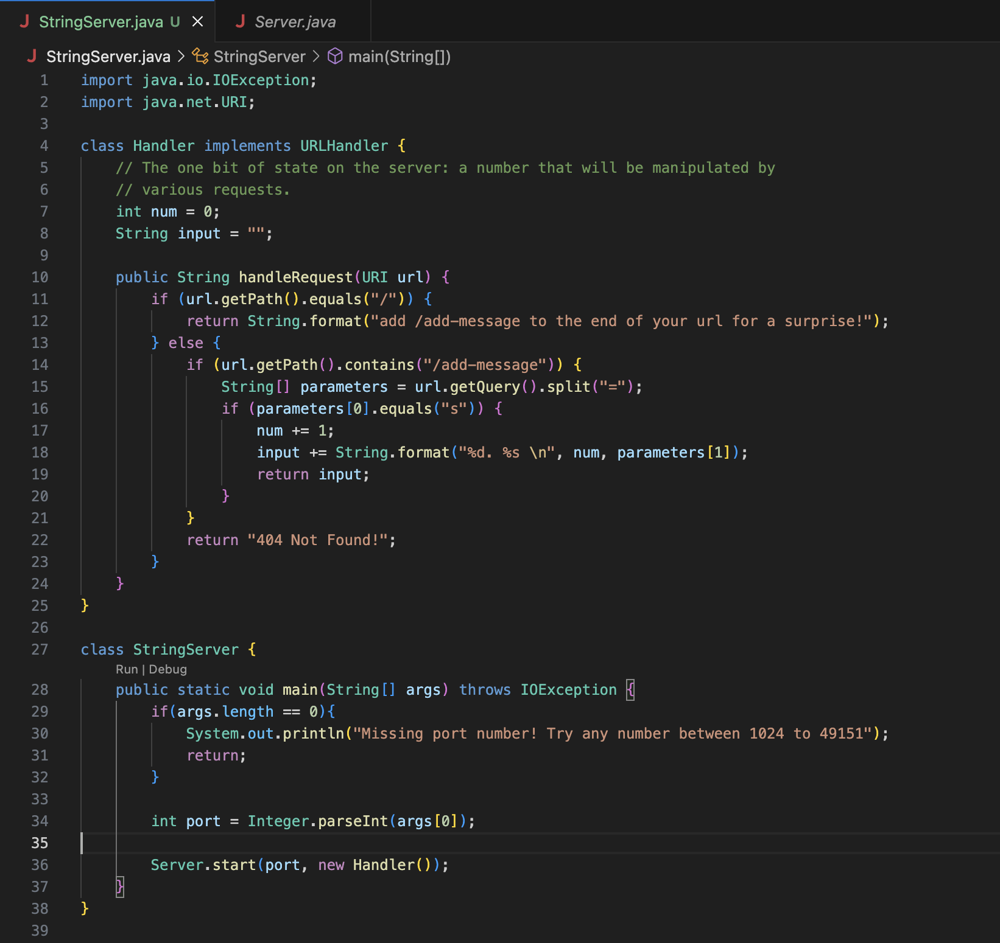
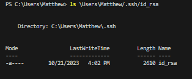
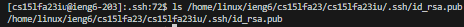
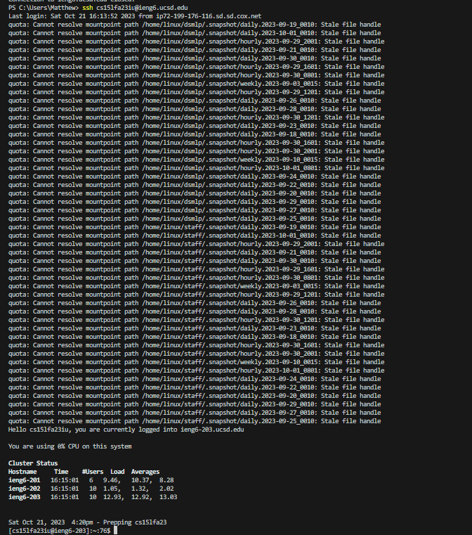

# Part 1
**Code for the string Server:** 
 

**Screenshot after using the request "/add-message?s=Hello:"**

The two methods that are called in my code are the main method (public static void main (String[] args), and the handleRequest method (public String handleRequest(URI url)). The relevant argument to the main method is the length of args, which determines the port number. The relevant argument for handleRequest is the url of the server, which determines what will be printed to the screen. The value of the length of args should not be changed by modifying the url, because the port number is determined before the server even goes up, and should stay constant with any variation of the url. The value of the url argument will actually vary quite a bit, and whatever it ends up being will determine what is printed on the screen. For this example, we type in the original url (http://localhost:4000), and add "/add-message?s=Hello" to it. Since we have "/add-messages", that tells our method to take the else if statment, checking the query, and printing "1. Hello" (it prints the 1. because int num is incremented from 0 to 1, it prints Hello because parameters[1] is "Hello").

**Screenshot after using the request "/add-message?s=How are you:"**

The two methods that are called in my code are the same two from the previous example, the main method (public static void main (String[] args), and the handleRequest method (public String handleRequest(URI url)). The relevant argument to the main method is the length of args, which determines the port number (same value as after the hello request). The relevant argument for handleRequest is the url of the server, which determines what will be printed to the screen (different query than the hello request). The value of the length of args should once again not be changed by modifying the url, because the port number is determined before the server even goes up, and should stay constant with any variation of the url. Even though the url has a different query, the program will still take the same overall path as the hello request. This is because the path of the url is the same, so the else if statement runs once again, this time with a value of "How are you" for parameters[1] instead of "Hello" like the previous example. We are left with 2. "How are you" being printed because it is the second message added to the server. 

# Part 2
**The path to my private key:**  

 
**The path to the remote public key:**  

 
**Me remote connecting without a password:**  

# Part 3
One thing that I learned from weeks 2 and 3 was how to gain access to a remote computer. We did this by using the ssh command to connect to another computer remotely, and using the password that we knew to gain access. By week 3, we made it so that we didn't even need a password to gain access to the remote computer, which I thought was really interesting. 
