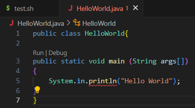
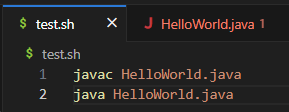

# Part 1 - Debugging Scenario
1.   
2.   
3.     
The bug was in my `HelloWorld.java` file (like I guessed), where I put `System.in.println("Hello World!")` instead of the correct syntax for a print statement in java, which is `System.out.println("Hello World!")`. I used the TA's response to look up the correct syntax and compared it to my own code, where I realized the difference between the two. 
4.  
  a) The file and directory structure needed: needed to be in the directory `~Desktop/LabReport5`, which contained the files:`HelloWorld.java` and `test.sh`
     b) Files before fixing the bug- 
        `HelloWorld.java`:   
     `test.sh`:      
  c) The full command line I ran to trigger the bug: `bash test.sh`  
  d) To fix the bug, I went back into where the error was found (`HelloWorld.java` line 5), and checked to see if I saw anything wrong with the print statement, like the TA said to do. Once I didn't, I then searched the internet for the correct syntax of a print statement in java. Upon realizing it was different from mine, I changed it to match the `System.out.println("Hello World!")` I had seen online, and ran `test.sh` once again. I was greeted with the actual expected output: `Hello World!` instead of the bug I was greeted with before, showing that my fix worked. 
# Part 2 - Reflection
In this class, I learned a fair bit about the command line and what I can do with it. By far, I think the most useful thing we learned in thie class was how to run debug tests. These tests are **EXTREMELY** useful when it comes to finding out exactly where a bug in your code is so that you can fix it, which will be a big part of what many people spend their time doing in the field. Knowing how to properly test your code can result in faster and better debugging sessions, resulting in you getting more work done. 
