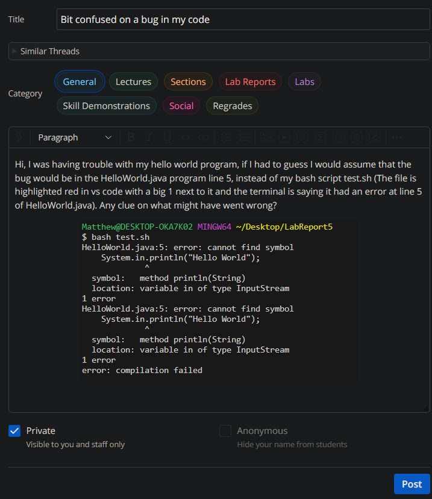
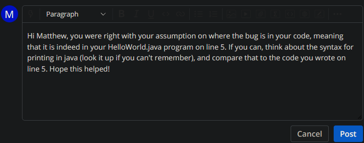
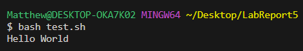

# Part 1 - Debugging Scenario
1.   
2.   
3.     
The bug was in my `HelloWorld.java` file (like I guessed), where I put `System.in.println("Hello World!")` instead of the correct syntax for a print statement in java, which is `System.out.println("Hello World!")`. I used the TA's response to look up the correct syntax and compared it to my own code, where I realized the difference between the two. 
4.  
  a) The file and directory structure needed: needed to be in the directory `~Desktop/LabReport5`, which contained the files: `HelloWorld.class`, `HelloWorld.java`, and `test.sh`
  b) Files before fixing the bug:  
     `HelloWorld.class`:  
     `HelloWorld.java`:  
     `test.sh`:  
  c) The full command line I ran to trigger the bug:   `bash test.sh`
  d) To fix the bug, I went back into where the error was found (`HelloWorld.java` line 5), and checked to see if I saw anything wrong with the print statement, like the TA said to do. Once I didn't, I then searched the internet for the correct syntax of a print statement in java. Upon realizing it was different from mine, I changed it to match the `System.out.println("Hello World!")` I had seen online, and ran `test.sh` once again. I was greeted with the actual expected output: `Hello World!` instead of the bug I was greeted with before, showing that my fix worked. 
